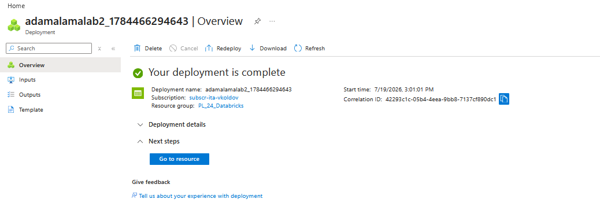
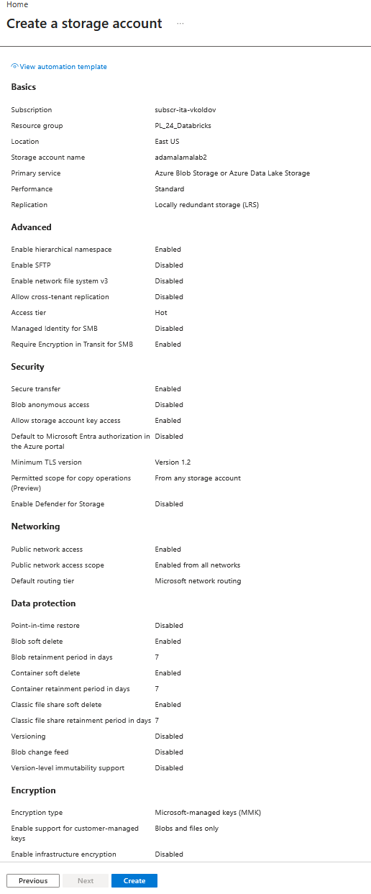
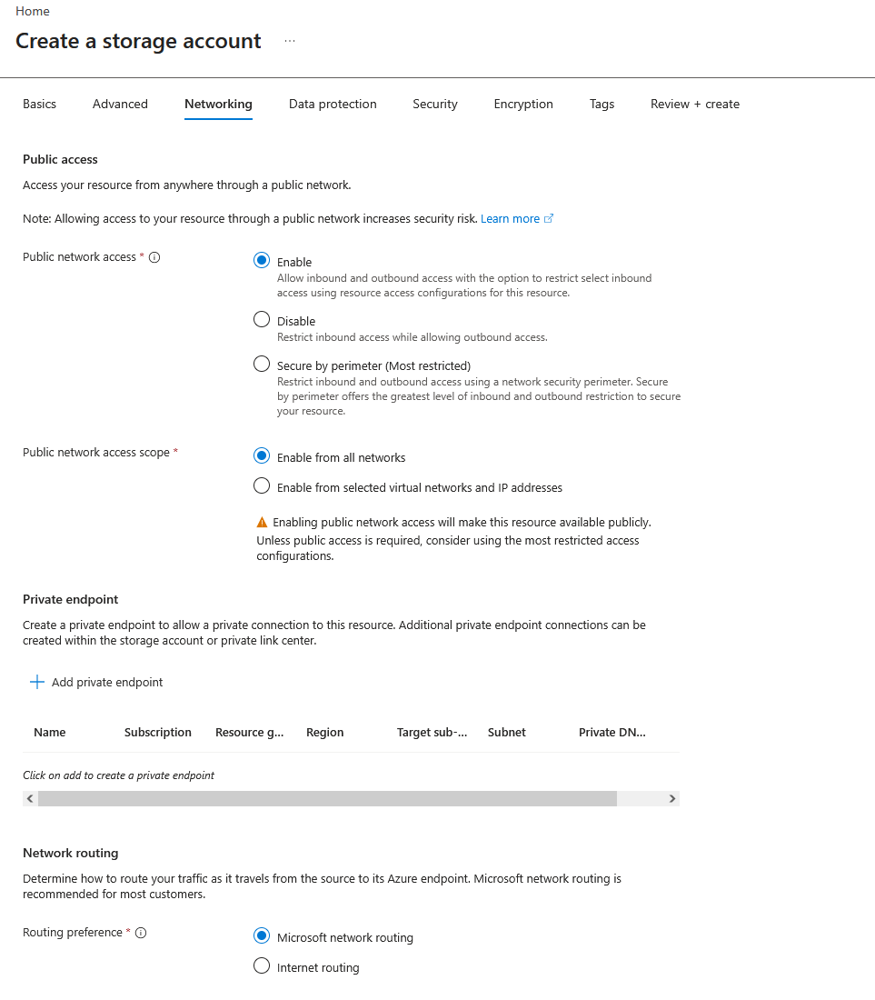
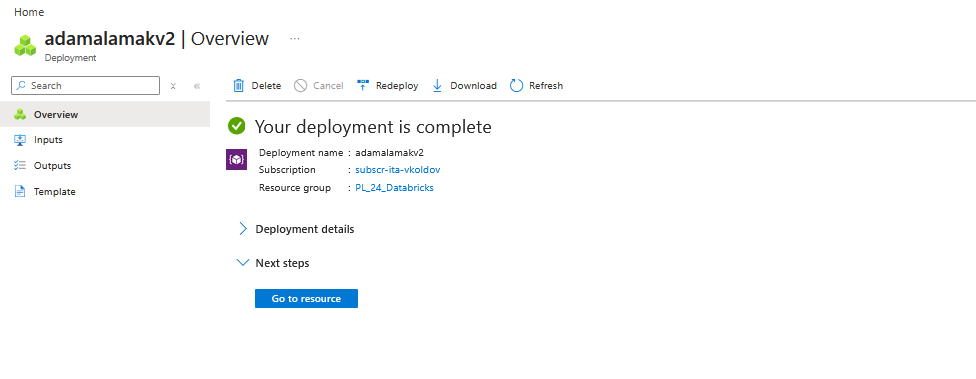
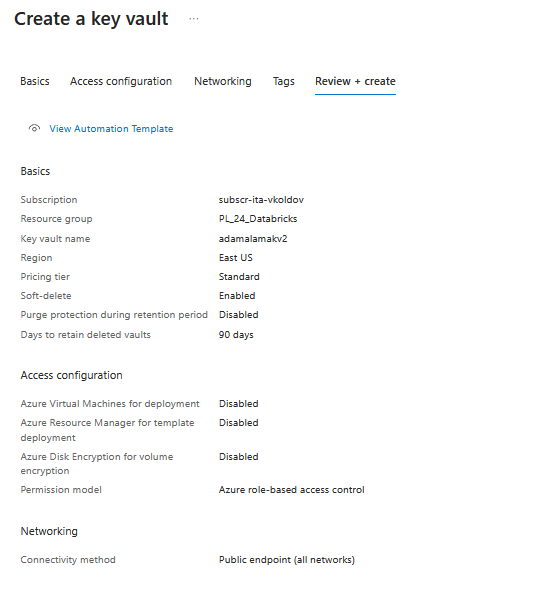
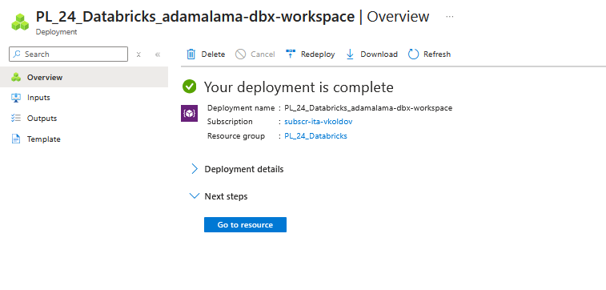
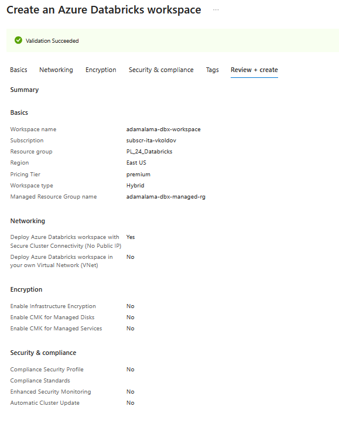
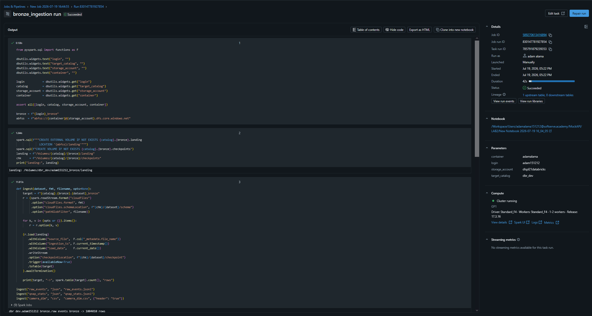

# Lab 2 - Azure Medallion Lakehouse (Databricks + Unity Catalog)

Governed medallion lakehouse on Azure. Continuation of Lab 1 (the MockAPI telemetry pipeline on AWS).
The lab runs in two stages: first provision the core Azure services yourself to learn the creation
flow (Stage 1), then converge on shared resources to build the lakehouse (Stage 2).

- **Shared ADLS Gen2:** `dlspl21databricks`
- **Shared workspace / catalog:** `dbr_dev`
- **Own container:** `adamalama` · **External location:** `adam151212_ext`
- **Medallion schemas:** `dbr_dev.adam151212_{bronze,silver,gold}`

---

## Stage 1 - self-provisioned resources (learning)

Own instance of each core service, created to see the parameters that matter. All three live in
resource group `PL_24_Databricks`, region **East US**.

### Storage Account (ADLS Gen2) - `adamalamalab2`
Key parameters: **Standard** performance, **LRS** redundancy, **hierarchical namespace ON**
(required for ADLS Gen2), **Hot** access tier, public network access enabled.

### Key Vault - `adamalamakv2`
Key parameters: **Standard** tier, **permission model = Azure RBAC**, soft-delete ON, purge
protection OFF.

> Note: the RBAC permission model (chosen here) later blocked creating a Key Vault-backed secret
> scope — the model can't be changed after creation. See the legacy-access notebook for the
> Databricks-backed scope used instead.

### Databricks workspace - `adamalama-dbx-workspace`
Key parameters: **Premium** pricing tier, own **managed resource group**, default (secure) networking.

---

## Stage 2 - shared resources (the actual lakehouse)

Built on the shared ADLS + shared workspace + shared storage credential
(`databricks_uc_connector`):

1. **Own container** `adamalama` in the shared ADLS.
2. **UC external location** `adam151212_ext` on the shared credential, pointing at the container root.
3. **Medallion schemas** `adam151212_{bronze,silver,gold}` with `MANAGED LOCATION` to container subfolders.
4. **Bronze ingestion** (`bronze_ingestion` notebook) - Auto Loader (`cloudFiles`) loads RAW files into
   3 Delta tables **idempotently**, with metadata columns (`source_file`, `ingestion_ts`, `load_date`).
5. **Job** `adam151212_bronze_ingestion` runs the ingestion on the shared **all-purpose cluster GP1**
   (not a job cluster — deliberate, to control cost on shared infra).
6. **Legacy access** (`legacy_access` notebook) - SPN + `dbutils.fs.mount`, creds read from a secret
   scope. Blocked by Unity Catalog on this cluster (documented + migration path).

### Job run (bronze ingestion)

---

## Notebooks
- `bronze_ingestion` - Auto Loader ingestion into `adam151212_bronze` (3 Delta tables).
- `legacy_access` - legacy SPN mount attempt
